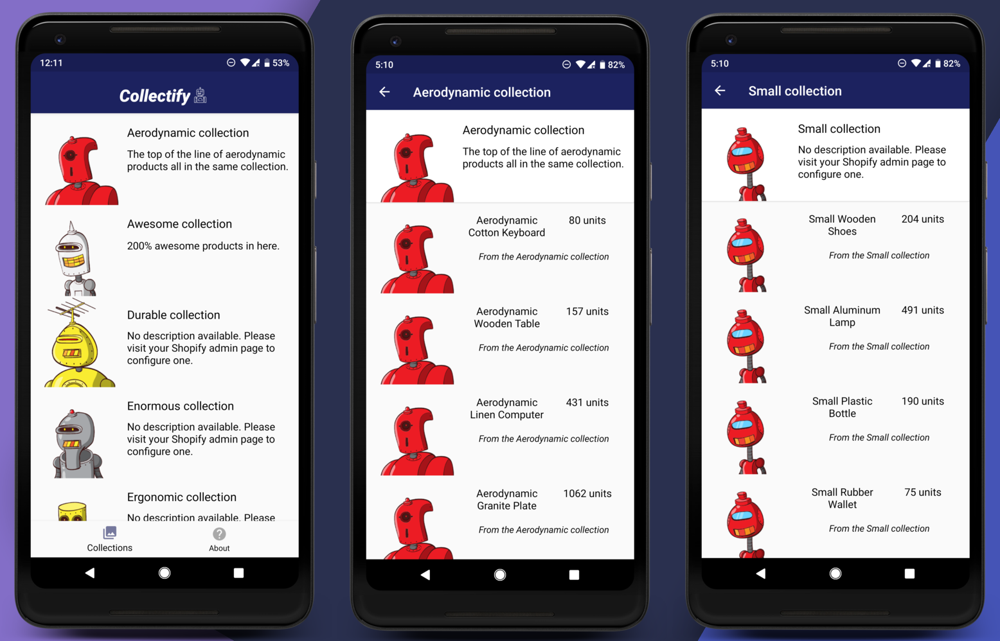
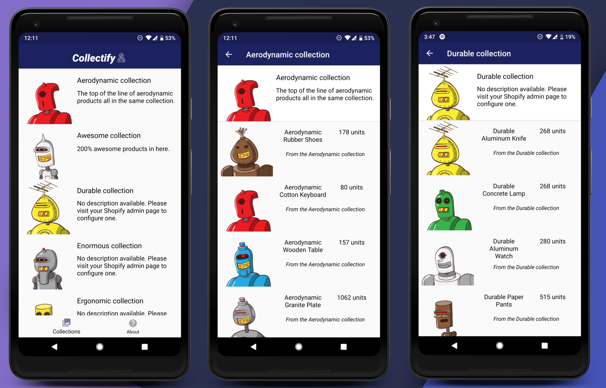

## *COLLECTIFY*




Collectify is a simple Android application intended to display a collection list. A user can then click on a specific collection to view a list of products as well its inventory.

An exercise in the use of recyclerviews, as well as REST to fetch data (although I do not recommend using loopj in production builds and my use of nested get requests may not be ideal).
Feel free to also use it as a basic bottom navigation template.

## TESTING WITHOUT ANDROID STUDIO

Simply download and install the APK file in the APK folder and install it on your device (API 21 (Lolipop) required).
You may need to enable downloads outside the play store on your devices settings.

## USAGE

If you plan on using the recycler adapters and plan to load images, you must use Square's Picasso library
Alternatively, you could use Glide, just change or delete the line of code loading the image.

```
implementation 'com.squareup.picasso:picasso:2.71828'
```

Moreover, I originally made this to display the image of the products in the collection details list, but the requirements require an image of collection in every row instead. To switch back to the products alternative:

```
JSONObject imageObject = product.getJSONObject("image");

if (imageObject != null) {
  // removing the escape chars so that the image can be loaded
   String imageUrl = imageObject.getString("src").replaceAll("(?<!https:)//", "/");

   collectionDetailsList.add(new CollectionDetails(collectionName, productTitle, inventory, imageUrl));

} else {
   // if there is no image, this points to an image that displays "no image available"
   collectionDetailsList.add(new CollectionDetails(collectionName, productTitle, inventory, getResources().getString(R.string.details_activity_no_image_url)));
}
 ```

 Where the string *details_activity_no_image_url* is a url to an image that displays no image available 

#### Implemented with product images

 


## ACKNOWLDGEMENTS  

The icons used in the splash screen and toolbar are provided by Freepik from www.flaticon.com 

All other images are fetched through JSON and are property of Shopify.

## LICENSE 
 
MIT license, but TTLDR; do whatever you want and use this code as you please (no attrition or anything needed)


